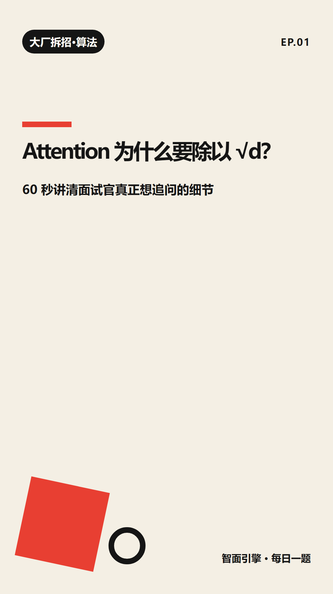
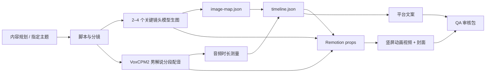

# 智面引擎 · ZhiMian Video Studio

> 一个面向“AI 使用技巧 × 大厂技术面试拆招”的本地优先短视频生产 Skill：从选题、脚本、模型生图、VoxCPM2 男解说主播配音、Remotion 竖屏动画、封面、平台文案到 QA 审核包，按日期沉淀为可复查的内容资产。



## 为什么做它

技术内容账号最难的不是“今天发什么”，而是每天稳定产出一条可信、可复查、风格统一的视频。智面引擎把这个流程做成 Codex Skill + Remotion 工程 + VoxCPM2 配音适配器：

- 内容定位：大厂面试技术细节、AI/算法、后端、系统设计、AI 实操方法。
- 内容规划：既能先生成某个时间段的 `content-plan.json`，也能直接指定一个主题立刻生产。
- 视频形态：统一 9:16 竖屏，适配小红书、抖音、B站竖屏。
- 动画表达：Remotion 时间轴支持流程流动、左右对比、公式揭示、代码卡片和动态背景，不只是文字翻页。
- 生图表达：每期默认选择 2–4 个关键镜头调用模型生图，并由 Remotion 加入裁切、揭示和缓慢镜头运动；生图失败时自动回退到纯动效镜头。
- 生产节奏：支持 17:00 自动生产、19:00 审核交付，也支持手动立即触发。
- 输出资产：每次生产落到 `outputs/YYYY-MM-DD/`，保留视频、封面、配音、文案、来源、时间轴、QA 报告。
- 安全边界：默认男性专业解说主播合成音色；不自动发布；不伪造来源；不做未经授权的真人声音克隆。

## Demo

- 封面预览：[`demo/media/cover.png`](demo/media/cover.png)
- 动画预览帧：[`demo/media/frame-30.png`](demo/media/frame-30.png)
- Remotion 短片段：[`demo/media/fixture.mp4`](demo/media/fixture.mp4)
- 示例输出包：[`demo/sample-output/2026-06-18/`](demo/sample-output/2026-06-18/)

示例输出包展示了真实生产目录的核心结构：`manifest.json`、`script/timeline.json`、三平台文案、来源占位和分镜脚本。仓库不内置完整日更视频大文件，实际内容由本机命令生成到 `outputs/`。

## HTML 知识分享

除了竖屏视频，本仓库还沉淀了**可直接浏览器打开的交互式 HTML 知识分享网页**，配合动态动画讲解 AI 技术概念，适合回看、自学和投屏讲解。每期网页均为自包含单文件或已构建的前端工程，无需额外依赖。所有网页源码开源在本仓库的 `knowledge-sharing/` 目录下，供大家学习。

所有网页源码位于 [`knowledge-sharing/`](knowledge-sharing/) 目录，按日期排列：

| 日期 | 主题 | 路径 | 说明 |
| --- | --- | --- | --- |
| 2026-07-21 | Agent 框架全景 | [`knowledge-sharing/2026-07-21-agent-frameworks/index.html`](knowledge-sharing/2026-07-21-agent-frameworks/index.html) | 主流 Agent 框架对比与架构图 |
| 2026-07-25 | 知识宇宙 | [`knowledge-sharing/2026-07-25-knowledge-universe/index.html`](knowledge-sharing/2026-07-25-knowledge-universe/index.html) | 知识管理体系与工具链 |
| 2026-07-28 | MoE 路由机制 | [`knowledge-sharing/2026-07-28-moe-router/index.html`](knowledge-sharing/2026-07-28-moe-router/index.html) | 混合专家模型路由可视化（React 构建） |
| 2026-07-29 | TRAE 小白教程 | [`knowledge-sharing/2026-07-29-trae-tutorial/index.html`](knowledge-sharing/2026-07-29-trae-tutorial/index.html) | 从零搭建 AI 视频生产线全流程教程 |
| 2026-07-31 | RAG 全流程拆解 | [`knowledge-sharing/2026-07-31-rag-pipeline/index.html`](knowledge-sharing/2026-07-31-rag-pipeline/index.html) | 12 页分页式幻灯片，从幻觉诊断到六步流程，含向量化 4 步动画与重排序演示，配合 VoxCPM2 统一男声配音实现音画同步 |
| 2026-07-31 | MCP 模型上下文协议 | [`knowledge-sharing/2026-07-31-mcp-protocol/index.html`](knowledge-sharing/2026-07-31-mcp-protocol/index.html) | 12 页分页式幻灯片，Tao 同学立场：MCP 是 AI 操作的必经之路。重点拆解 MCP 做什么（标准化连接 N×M→N+M、动态发现、三层架构）与为什么重要（生态统一、工具复用、Agent 时代底座），含命令行方式对比两页与三原语解析 |

**使用方式**：

```powershell
git clone https://github.com/PoseZhaoyutao/zhimian-video-studio.git
cd zhimian-video-studio/knowledge-sharing

# 直接浏览器打开任意一期
start 2026-07-31-rag-pipeline/index.html
```

> 每期网页均为 1920×1080 固定画布，分页式设计无需滚动，动画自动播放，适合录屏配音后发布为视频。网页开头和结尾均标注"关注 Tao 同学"及本仓库的 `knowledge-sharing/` 目录地址，方便观众查阅源码。

## 30 秒快速开始

```powershell
git clone https://github.com/PoseZhaoyutao/zhimian-video-studio.git zhimian-video-studio
cd zhimian-video-studio

python -m venv .venv
.\.venv\Scripts\Activate.ps1
pip install -r requirements.txt

npm install --prefix remotion

python skills/zhimian-video-studio/scripts/run_daily.py `
  --date 2026-06-18 `
  --output-root outputs `
  --dry-run `
  --skip-audio `
  --skip-render
```

上面的命令会生成一个离线审核包，不调用 VoxCPM2，也不启动真实视频渲染，适合先验证目录结构和文案链路。

## 真实生产命令

准备好 VoxCPM2 和 Remotion 依赖后，运行：

```powershell
$env:ZHIMIAN_REPO_ROOT = (Get-Location).Path
$env:VOXCPM2_PROJECT = "D:\Project\VoxCPM2\VoxCPM"

python skills/zhimian-video-studio/scripts/run_daily.py `
  --date 2026-06-18 `
  --output-root outputs `
  --mode manual
```

先生成一份可编辑的时间段内容规划：

```powershell
python skills/zhimian-video-studio/scripts/run_daily.py `
  --make-plan `
  --plan-start 2026-07-01 `
  --plan-days 14 `
  --plan-theme "AI工具与技术面试" `
  --plan-output plans
```

按规划文件生成某一天：

```powershell
python skills/zhimian-video-studio/scripts/run_daily.py `
  --date 2026-07-03 `
  --plan-file plans/2026-07-01_to_2026-07-14/content-plan.json `
  --output-root outputs `
  --mode manual
```

也可以直接指定主题，不走默认选题：

```powershell
python skills/zhimian-video-studio/scripts/run_daily.py `
  --date 2026-07-03 `
  --topic "如何用AI审查后端系统设计方案" `
  --column "AI实操" `
  --output-root outputs `
  --mode manual
```

重做当天内容并保留旧版本：

```powershell
python skills/zhimian-video-studio/scripts/run_daily.py `
  --date 2026-06-18 `
  --output-root outputs `
  --mode manual `
  --rebuild
```

> 当前实现会先打包模型生成图片并生成 VoxCPM2 分段 WAV，再把图片和音频复制到 Remotion `public/generated/YYYY-MM-DD/`，写出 `script/remotion-props.json`，最后渲染 `video/final-9x16.mp4` 和 `cover/cover-9x16.png`。

## 模型生图工作流

每期默认选择 2–4 个最需要视觉解释的镜头，例如开场钩子、抽象原理、行业案例或错误对比。图片由 Codex/模型侧生图工具生成，Remotion 负责统一裁切、边框、揭示、缓慢镜头运动和字幕避让，避免成片退化成静态幻灯片。

先把生成图片保存到本地，再按稳定的场景 id 编写 `image-map.json`：

```json
{
  "hook": {
    "path": "D:/staging/hook.png",
    "alt": "教师正在指挥 AI 辅助科普视频工作台",
    "prompt": "Editorial concept illustration of a teacher directing an AI-assisted vertical video studio, centered portrait-safe composition, no words, no logo, no watermark"
  },
  "principle": {
    "path": "D:/staging/principle.webp",
    "alt": "抽象技术原理被拆成可验证的流程",
    "prompt": "Editorial technical concept art showing an abstract mechanism becoming a verifiable workflow, centered subject, no words, no logo, no watermark"
  }
}
```

生产时传入图片映射：

```powershell
python skills/zhimian-video-studio/scripts/run_daily.py `
  --date 2026-07-03 `
  --topic "如何用AI审查后端系统设计方案" `
  --column "AI实操" `
  --image-map staging/image-map.json `
  --output-root outputs `
  --mode manual
```

CLI 仅接受现有的 PNG、JPEG 或 WebP 文件，并将图片、替代文本和原始提示词写入审计包。若生图工具不可用或某张图片失败，流程会记录 `motion-only` 降级状态并继续使用 Remotion 动效，不阻塞配音、渲染和交付。完整选择、提示词与 QA 规范见 [`generative-visuals.md`](skills/zhimian-video-studio/references/generative-visuals.md)。

## 新增能力

- **统一音色（默认开启）**：每条视频都用一段合成男声锚点让全片音色一致（AI 合成，非真人克隆）；只有用户明确要求各段独立配音时才用 `--no-unify-timbre` 关闭。
- **自定义脚本 `--scenes-file` + 封面副标题 `--benefit`**：用手写场景做教程/推广等自定义选题，绕开仅适配面试/推广的自动脚本。
- **智能生图接口 `--image-gen-cmd`**：给场景加 `image_prompt`，再传一个 `"...{prompt}...{out}..."` 命令模板即可接入任意生图后端；失败自动 `motion-only` 降级，记录在 `logs/image-gen.log`。显式 `--image-map` 优先级更高。
- **本地视频剪辑 `--edit-plan`**：ffmpeg 后端的本地合成层（拼接 / 交叉淡入 / B-roll·Logo 叠加 / 背景音乐混音），与 Remotion 渲染解耦。计划格式与用法见 [`editing.md`](skills/zhimian-video-studio/references/editing.md)。
- **HyperFrames × Remotion**：用 `hyperframes` 技能做动效设计，Remotion 仍是唯一确定性渲染器，映射规范见 [`hyperframes-motion.md`](skills/zhimian-video-studio/references/hyperframes-motion.md)。
- **路线图**：口播 / presenter 风格与更丰富的剪辑能力将基于上述剪辑层继续构建。

```powershell
# 智能生图（任意后端）
python skills/zhimian-video-studio/scripts/run_daily.py --date 2026-06-19 `
  --scenes-file scenes.json --image-gen-cmd "python my_sd.py --prompt {prompt} --out {out}"

# 本地剪辑：把多段片段合成一条交付视频
python skills/zhimian-video-studio/scripts/run_daily.py `
  --edit-plan edit-plan.json --edit-output outputs/2026-06-19/video/edited-9x16.mp4
```

## 输出目录

```text
outputs/YYYY-MM-DD/
├── manifest.json
├── research/sources.md
├── script/narration.md
├── script/timeline.md
├── script/timeline.json
├── script/remotion-props.json
├── assets/image-plan.json
├── assets/generated/*.{png,jpg,jpeg,webp}
├── audio/segments/*.wav
├── audio/narration.wav
├── video/final-9x16.mp4
├── cover/cover-9x16.png
├── copy/xiaohongshu.md
├── copy/douyin.md
├── copy/bilibili.md
├── qa/report.json
└── logs/production.log
```

## 架构



核心文件：

| 路径 | 作用 |
| --- | --- |
| `skills/zhimian-video-studio/SKILL.md` | Codex Skill 入口，定义触发词、工作流和安全边界。 |
| `skills/zhimian-video-studio/references/content-calendar.md` | 内容规划协议：时间段计划、指定主题、兜底种子。 |
| `skills/zhimian-video-studio/references/generative-visuals.md` | 模型生图的镜头选择、提示词、安全边界、审计与降级规则。 |
| `skills/zhimian-video-studio/scripts/run_daily.py` | 日更/手动生产 CLI，也支持 `--make-plan`、`--topic`、`--plan-file`、`--image-map`。 |
| `skills/zhimian-video-studio/scripts/zhimian/planner.py` | 内容规划、规划文件读取和自定义选题推断。 |
| `skills/zhimian-video-studio/scripts/zhimian/images.py` | 校验、复制和记录模型生成图片，并把图片元数据注入分镜。 |
| `skills/zhimian-video-studio/scripts/zhimian/vox.py` | VoxCPM2 适配器。 |
| `remotion/` | React/Remotion 竖屏视频、封面和可复用动作模板。 |
| `tests/` | Skill、CLI、时间轴、VoxCPM2 适配器、QA 契约测试。 |

## 安装方式

如果你只是想跑完整生产仓库，请看 [安装教程](docs/INSTALL.md)。

如果你要把它作为 Codex Skill 安装到本机：

```powershell
$repo = "D:\Project\StudentsVideo\zhimian-video-studio"
$target = "$env:USERPROFILE\.codex\skills\zhimian-video-studio"

New-Item -ItemType Directory -Force -Path (Split-Path $target) | Out-Null
Copy-Item -Recurse -Force "$repo\skills\zhimian-video-studio" $target

$env:ZHIMIAN_REPO_ROOT = $repo
```

安装后，在 Codex 里说“调用智面引擎”“规划未来一周内容”“指定主题生成视频”“生成今天的视频”“重做今天的视频”，Skill 会按 `SKILL.md` 的生产流程执行。因为 Remotion 工程在仓库根目录，建议长期把 `ZHIMIAN_REPO_ROOT` 写进 PowerShell profile 或系统环境变量。

## VoxCPM2 教程

详见 [VoxCPM2 本地配音教程](docs/VOXCPM2.md)。最小配置如下：

```powershell
$env:VOXCPM2_PROJECT = "D:\Project\VoxCPM2\VoxCPM"
$env:VOXCPM2_MODEL_SOURCE = "openbmb/VoxCPM2"
$env:VOXCPM2_VOICE_PROMPT = "专业男性解说主播，清晰沉稳，有亲和力，适合科普与行业推广，停顿自然"
```

默认策略是“AI 设计合成音色”。如果要使用参考音频做真人声线克隆，必须显式传入授权参数；当前适配器会拒绝未授权的 voice clone。

## 验证

```powershell
pytest -q
npm.cmd --prefix remotion run typecheck
npm.cmd --prefix remotion run compositions
```

Skill 格式校验：

```powershell
$env:PYTHONUTF8 = "1"
python C:\Users\admin\.codex\skills\.system\skill-creator\scripts\quick_validate.py `
  skills/zhimian-video-studio
```

## 平台文案策略

同一条视频会生成三份文案，但不会简单复制：

- 小红书：收藏感、笔记感、标签密度更高。
- 抖音：更短的钩子、更强互动问题。
- B站：标题更解释型，描述更适合学习复盘。

## 内容原则

智面引擎不是“背面经”的流水线。每期内容必须能回答：

1. 面试官到底在问什么？
2. 底层原理是什么？
3. 追问链会怎么展开？
4. 高分回答如何组织？
5. 哪些地方容易答错或被继续追问？

## 自动化建议

本仓库支持 CLI 级手动调用；在 Codex 桌面端可配合每日 17:00/19:00 heartbeat 自动化：

- 17:00：生产当天审核包。
- 19:00：读取 QA 和产物，向当前线程交付审核链接。

自动化只做生产和审核提醒，不自动发布到小红书、抖音或 B站。

## 文档

- [安装教程](docs/INSTALL.md)
- [VoxCPM2 本地配音教程](docs/VOXCPM2.md)
- [模型生图规范](skills/zhimian-video-studio/references/generative-visuals.md)
- [Demo 说明](docs/DEMO.md)
- [设计规格](docs/superpowers/specs/2026-06-18-zhimian-video-studio-design.md)
- [模型生图设计](docs/superpowers/specs/2026-06-18-model-generated-visuals-design.md)
- [验证记录](docs/verification/2026-06-18-zhimian-verification.md)

## 许可证

当前仓库未附带开源许可证。公开发布前建议明确选择 MIT、Apache-2.0 或私有闭源策略。
