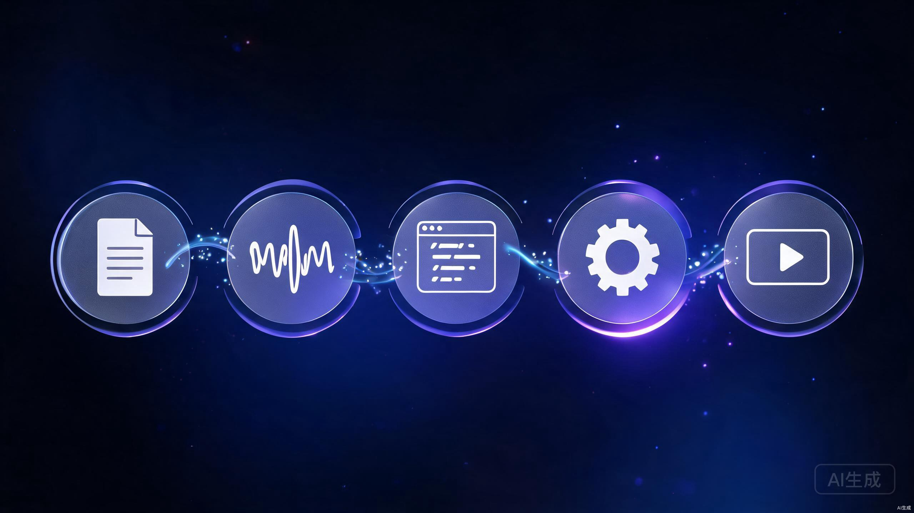
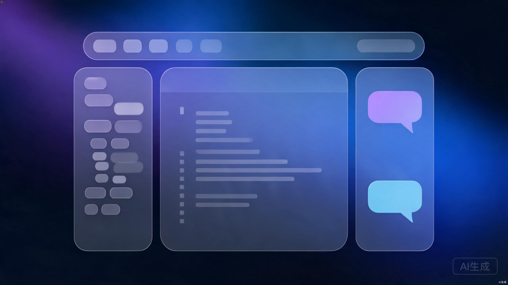
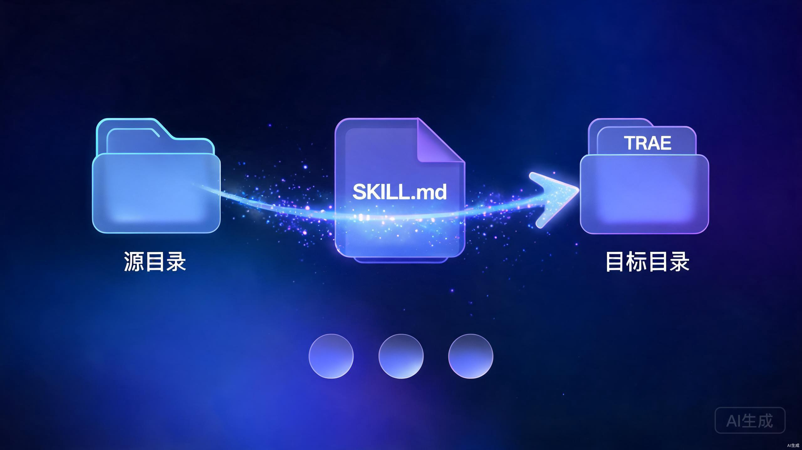
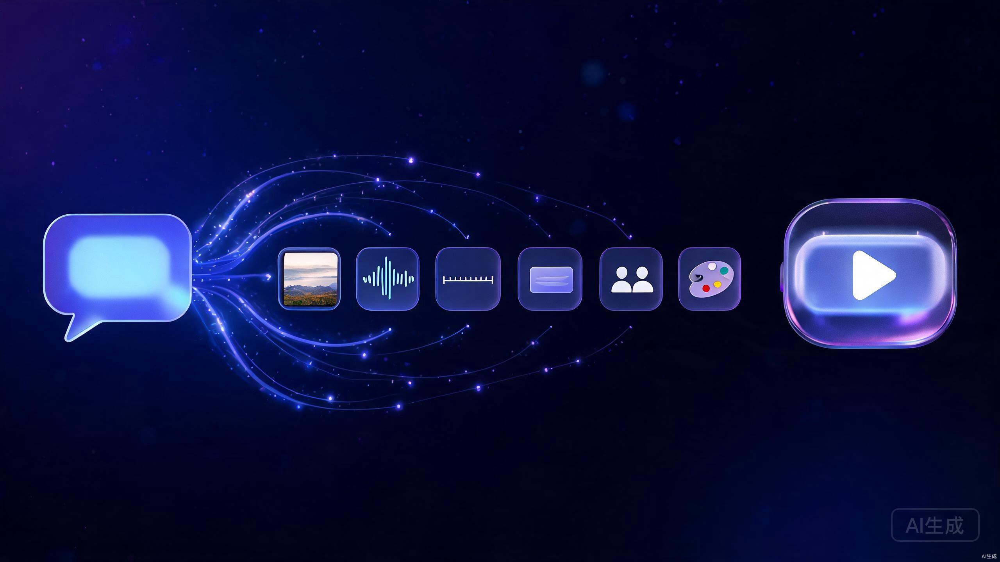

# TRAE + 智面引擎：零基础视频创作完整教程

> **适用对象**：从未写过代码的电脑使用者，从下载软件到产出第一支AI解说视频，全流程照做即可。
> **平台**：Windows 10/11
> **预计耗时**：首次配置约1-2小时，之后每支视频约15-30分钟

---

## 第1章 心智模型：先搞懂这些概念

在动手之前，用三个类比建立认知，避免后续每一步都迷茫。

### 1.1 TRAE 是什么

**类比**：TRAE 是一个"会写代码的AI助手操作系统"，类似一个装了AI大脑的 VS Code。

- **不是**：聊天机器人（如 ChatGPT 网页版）
- **是**：一个完整的编程环境，AI 能直接读写你电脑里的文件、运行命令、生成视频
- **核心能力**：你用自然语言说"帮我做一期关于MoE路由的视频"，它会自动写脚本、配音、渲染

### 1.2 智面引擎（zhimian-video-studio）是什么

**类比**：智面引擎是 TRAE 的一个"插件"，专门做9:16竖屏AI解说视频。

- **不是**：一个独立的软件
- **是**：一套技能（Skill），告诉 TRAE 如何按"研究→脚本→配音→渲染→QA"的流程产出视频
- **产出**：9:16 竖屏 mp4 视频 + 封面图 + 三平台文案（小红书/抖音/B站）

### 1.3 整体流程图

```
你（说一句话）
    ↓
TRAE（AI助手，理解需求）
    ↓
智面引擎技能（执行视频生产流程）
    ↓
┌─────────────────────────────────┐
│ 1. 调研写脚本                    │
│ 2. VoxCPM2 生成配音（男声）      │
│ 3. Remotion 渲染视频画面         │
│ 4. QA 质量检查                   │
└─────────────────────────────────┘
    ↓
outputs/日期/video/final-9x16.mp4（成品视频）
```

**流程示意**：



### 1.4 你需要准备什么

| 项目 | 说明 | 是否必须 |
| --- | --- | --- |
| 一台 Windows 10/11 电脑 | 8GB以上内存，20GB以上空闲磁盘 | 必须 |
| 网络 | 首次安装需要下载依赖 | 必须 |
| NVIDIA 显卡（可选） | 加速配音生成，没有也能跑（CPU慢些） | 可选 |

---

## 第2章 下载安装 TRAE

### 2.1 下载

1. 打开浏览器，访问 TRAE IDE 官方下载页：**https://www.trae.cn/ide/download**
2. 官方文档首页：https://docs.trae.cn/ （遇到问题先查这里）
3. 下载 Windows 版本安装包（.exe 文件）
4. 双击安装，默认路径即可

> **TRAE 产品家族说明**（来自官方文档）：
> - **TRAE IDE**：AI原生开发环境，本教程使用此产品
> - **TRAE Work**：AI原生工作台（网页/桌面/移动版）
> - **TRAE CLI**：命令行AI编程工具
> - **TRAE Plugin**：VS Code / JetBrains 插件
>
> 本教程以 **TRAE IDE** 为准。

### 2.2 首次启动

1. 打开 TRAE
2. 使用账号登录（按界面提示注册或登录）
3. 看到主界面后，说明 TRAE 已就绪

**TRAE IDE 界面示意**：



### 2.3 验证安装成功

打开 TRAE 后，看到主界面（左侧资源管理器、右侧编辑区、顶部菜单栏齐全）即说明安装成功。

> **注意**：TRAE IDE 是图形化应用，没有 `trae` 命令行工具。**TRAE CLI** 是独立的命令行产品，本教程不使用。如果双击图标无反应，重启电脑后重试；仍失败则到 https://docs.trae.cn/ 查阅官方排错指南。

---

## 第3章 环境配置（最关键的一步）

> **为什么这步最关键**：90%的小白卡在这里。每个工具都必须装好，否则后续全跑不通。**每步都有验证命令，务必逐个验证**。

### 3.1 安装 Git

**作用**：下载智面引擎代码仓库需要。

1. 访问 https://git-scm.com/download/win
2. 下载 64-bit Git for Windows Setup
3. 双击安装，**全部默认下一步**即可

**验证**：打开 TRAE 终端，输入：
```powershell
git --version
```
显示 `git version 2.x.x` 即成功。

### 3.2 安装 Conda（Miniconda）

**作用**：创建独立的 Python 环境，避免污染系统。智面引擎和 VoxCPM2 配音模型都需要。

1. 访问 https://docs.conda.io/en/latest/miniconda.html
2. 下载 Windows 版 Miniconda Installer（64-bit）
3. 双击安装，**安装时勾选"Add Miniconda to PATH"**（重要！）
4. 安装路径建议默认（如 `C:\Users\你的用户名\miniconda3`）

**验证**：关闭并重新打开 TRAE 终端，输入：
```powershell
conda --version
```
显示 `conda 24.x.x` 即成功。

> **如果失败**：删除 miniconda3 文件夹重装，安装时务必勾选 Add to PATH。

### 3.3 创建 VoxCPM2 环境

**作用**：VoxCPM2 是配音模型，需要独立环境。

在 TRAE 终端依次执行：

```powershell
# 1. 创建环境（Python 3.11）
conda create -n VoxCPM2 python=3.11 -y

# 2. 激活环境
conda activate VoxCPM2

# 3. 升级 pip
pip install -U pip

# 4. 安装 VoxCPM2（包名 voxcpm，已与源码 vox.py 核对）
pip install voxcpm
```

> **PyTorch / CUDA 说明（重要）**：
> `pip install voxcpm` 会自动安装 PyTorch。如果你有 NVIDIA 显卡并希望 GPU 加速，需确认 PyTorch 与本机 CUDA 版本匹配。CPU 也能跑，但短句可能要几十秒。
>
> 已知的真实坑（来自项目记录 2026-07-13）：torch 与 torchvision 的 CUDA 版本不一致会导致生成失败。修复命令：
> ```powershell
> pip install torchvision --index-url https://download.pytorch.org/whl/cu130
> ```
> （`cu130` 对应 CUDA 13.0；按你本机 CUDA 版本调整，如 `cu121`、`cu124`）

> **模型下载说明**：
> `pip install voxcpm` 只装 Python 包。**首次调用配音时**，模型会自动从 HuggingFace 下载（仓库 `openbmb/VoxCPM2`，约 1-2GB），需要网络。下载后缓存于 `~/.cache/huggingface/`，后续运行不再下载。

**验证（冒烟测试）**：
```powershell
conda activate VoxCPM2

# 进入智面引擎仓库根目录（路径按实际位置调整）
cd D:\Project\StudentsVideo\zhimian-video-studio

# 设置 PYTHONPATH（skill 目录名含连字符，必须设置）
$env:PYTHONPATH = "$PWD\skills\zhimian-video-studio\scripts"

# 验证包可导入
python -c "from zhimian.vox import VoxAdapter; a=VoxAdapter(); print('VoxCPM2 环境 OK, 模型源:', a.model_source)"
```
显示 `VoxCPM2 环境 OK, 模型源: openbmb/VoxCPM2` 即通过。

> **如果只想验证包安装、不下载模型**：用 `python -c "import voxcpm; print('voxcpm 包安装成功')"`，不会触发模型下载。

### 3.4 安装 Node.js

**作用**：Remotion 视频渲染引擎依赖 Node.js。

1. 访问 https://nodejs.org/
2. 下载 **LTS 版本**（20.x 以上）
3. 双击安装，全部默认下一步

**验证**：
```powershell
node --version
npm --version
```
分别显示 `v20.x.x` 和 `10.x.x` 即成功。

### 3.5 安装 FFmpeg

**作用**：音频后处理（降噪、音量均衡）和视频合成。

**方法A（推荐，用 conda 安装）**：
```powershell
conda activate VoxCPM2
conda install -c conda-forge ffmpeg -y
```

**方法B（手动下载）**：
1. 访问 https://www.gyan.dev/ffmpeg/builds/
2. 下载 `ffmpeg-release-essentials.zip`
3. 解压到 `C:\ffmpeg`
4. 将 `C:\ffmpeg\bin` 添加到系统环境变量 PATH

**验证**：
```powershell
ffmpeg -version
```
显示版本号即成功。

### 3.6 环境配置总结检查

逐条复制粘贴执行，全部通过才能进入下一章：

```powershell
git --version
conda --version
node --version
npm --version
ffmpeg -version
conda activate VoxCPM2
python -c "import voxcpm; print('OK')"
```

> **全部通过后，环境配置完成。这步做好，后面就轻松了。**

---

## 第4章 安装智面引擎技能

### 4.1 下载智面引擎代码仓库

在 TRAE 终端执行：

```powershell
# 切换到你希望存放项目的目录
cd D:\Project

# 克隆智面引擎仓库（URL 已与 docs/INSTALL.md 核对）
git clone https://github.com/PoseZhaoyutao/zhimian-video-studio.git StudentsVideo\zhimian-video-studio
cd StudentsVideo\zhimian-video-studio
```

> **说明**：如果仓库已存在于本机（如 `D:\Project\StudentsVideo\zhimian-video-studio`），直接 `cd` 进入即可，无需重新克隆。

### 4.2 安装智面引擎 Python 依赖

```powershell
# 确保在 VoxCPM2 环境中
conda activate VoxCPM2

# 进入仓库根目录
cd D:\Project\StudentsVideo\zhimian-video-studio

# 安装依赖
pip install -r requirements.txt
```

**验证**：
```powershell
python -c "import numpy; print('numpy', numpy.__version__)"
```

### 4.3 安装 Remotion 渲染依赖

```powershell
# 进入 remotion 目录
cd D:\Project\StudentsVideo\zhimian-video-studio\remotion

# 安装 Node 依赖（首次约3-5分钟）
npm install
```

**验证**：
```powershell
npx remotion --version
```

### 4.4 配置环境变量

**关键步骤**：告诉智面引擎代码在哪、VoxCPM2 源码在哪（如适用）。

在 TRAE 终端执行（**每开新终端都要执行一次**，或写入 PowerShell 配置文件永久生效）：

```powershell
# 智面引擎仓库根目录（必须）
$env:ZHIMIAN_REPO_ROOT = "D:\Project\StudentsVideo\zhimian-video-studio"

# VoxCPM2 源码路径（仅当你用 git clone + pip install -e . 源码安装时需要；
# 如果你用 pip install voxcpm 装的 PyPI 包，这一行可以不设）
$env:VOXCPM2_PROJECT = "D:\Project\VoxCPM2\VoxCPM"

# 配音风格（默认男声解说，与 vox.py 源码默认值一致，无需改动）
$env:VOXCPM2_VOICE_PROMPT = "温文尔雅的男性解说主播，声音温暖醇厚，语速适中从容不迫，吐字清晰自然，带有学者气质，娓娓道来而不急不躁，适合深度科普与知识分享"
```

> **`VOXCPM2_PROJECT` 真实含义**（已与 vox.py 源码核对）：
> 它指向 VoxCPM2 的**源码工程根目录**，适配器会把 `VOXCPM2_PROJECT/src` 加入 `sys.path` 以便 `import voxcpm`。
> - 如果你用 `pip install voxcpm`（PyPI 包）：包已装到 site-packages，**不需要**设这个变量。
> - 如果你 `git clone https://github.com/OpenBMB/VoxCPM.git` 后 `pip install -e .`（源码安装）：**需要**设这个变量指向 clone 出来的目录。

**永久生效方法**（可选但推荐）：

```powershell
# 用记事本打开 PowerShell 配置文件
notepad $PROFILE
```

在文件末尾加入上面三行 `$env:` 语句，保存关闭。之后每次打开终端自动生效。

### 4.5 在 TRAE 中安装技能

**技能安装示意**：



> **以下信息来自 TRAE 官方文档**（https://docs.trae.cn/ide_skills ），已核实。

TRAE 技能通过 `SKILL.md` 文件定义管理。技能有两种类型：
- **全局技能**：跨项目生效，存放在 `%userprofile%\.trae-cn\skills\`
- **项目技能**：仅当前项目生效，存放在项目路径下的 `.trae/skills/`

智面引擎建议安装为**全局技能**（一次安装，所有项目可用）。有三种方式，任选其一。

#### 方式一：命令行复制（推荐，最快）

在 TRAE 终端执行：

```powershell
# 源目录（智面引擎技能本体）
$src = "D:\Project\StudentsVideo\zhimian-video-studio\skills\zhimian-video-studio"

# 目标目录（TRAE 全局技能目录，来自官方文档）
$dst = "$env:USERPROFILE\.trae-cn\skills\zhimian-video-studio"

# 创建目录并复制
New-Item -ItemType Directory -Force -Path (Split-Path $dst) | Out-Null
Copy-Item -Recurse -Force $src $dst
```

#### 方式二：通过 TRAE 设置界面导入（图形化，小白友好）

1. 在 TRAE 中前往 **设置 > 技能与命令**
2. 在 **技能** 部分，点击 **创建** 按钮，选择 **全局** 或 **项目**
3. 在弹出窗口中上传 `SKILL.md` 文件，或上传包含 `SKILL.md` 的 .zip 文件
   - 文件位置：`D:\Project\StudentsVideo\zhimian-video-studio\skills\zhimian-video-studio\SKILL.md`
4. TRAE 会自动解析并填充技能名称、描述、指令字段
5. 按需修改后点击 **确认**

#### 方式三：通过对话让 AI 自动创建

在 TRAE 对话框直接说：

```
帮我把 D:\Project\StudentsVideo\zhimian-video-studio\skills\zhimian-video-studio\SKILL.md 
注册为全局技能，技能名叫 zhimian-video-studio。
```

TRAE 会自动完成安装。

#### 验证技能是否被 TRAE 识别

1. 重启 TRAE
2. 前往 **设置 > 技能与命令**，在 **全局** 页签下应能看到 `zhimian-video-studio`
3. 在 TRAE 对话框中输入："调用智面引擎"
4. 如果 TRAE 响应并开始执行视频生产流程，说明技能已安装

> **官方文档参考**：https://docs.trae.cn/ide_skills
> **技能启用/禁用**：在技能面板通过开关控制。禁用后 TRAE 会在 `.trae/skill-config.json` 记录。

---

## 第5章 产出你的第一支视频

### 5.1 最简单的方式：用 TRAE 对话框

在 TRAE 对话框中直接输入：

```
帮我用智面引擎生成今天的视频，主题是"如何用AI审查后端系统设计方案"，栏目是AI实操。
```

TRAE 会理解你的意图，调用智面引擎技能，自动执行完整流程。

### 5.2 用命令行方式（更可控）

在 TRAE 终端执行：

```powershell
# 激活环境
conda activate VoxCPM2

# 设置环境变量（如果未写入 $PROFILE）
$env:ZHIMIAN_REPO_ROOT = "D:\Project\StudentsVideo\zhimian-video-studio"
$env:VOXCPM2_PROJECT = "D:\Project\VoxCPM2\VoxCPM"
$env:VOXCPM2_VOICE_PROMPT = "温文尔雅的男性解说主播，声音温暖醇厚，语速适中从容不迫，吐字清晰自然，带有学者气质，娓娓道来而不急不躁，适合深度科普与知识分享"

# 进入仓库根目录
cd D:\Project\StudentsVideo\zhimian-video-studio

# 设置 Python 路径
$env:PYTHONPATH = "$PWD\skills\zhimian-video-studio\scripts"

# 执行生产（用今天的日期，替换 2026-07-29 为实际日期）
python skills\zhimian-video-studio\scripts\run_daily.py `
  --date 2026-07-29 `
  --topic "如何用AI审查后端系统设计方案" `
  --column "AI实操" `
  --output-root outputs `
  --mode manual
```

### 5.3 先跑 dry-run 测试（推荐首次执行）

dry-run 不调用配音模型、不渲染视频，只生成脚本和占位文件，用于验证流程是否跑通：

```powershell
python skills\zhimian-video-studio\scripts\run_daily.py `
  --date 2026-07-29 `
  --output-root outputs `
  --dry-run `
  --skip-audio `
  --skip-render
```

**dry-run 成功标志**：`outputs/2026-07-29/` 目录下生成了 `manifest.json`、`script/narration.md`、`script/timeline.json` 等文件。

### 5.4 找到你的成品视频

生产完成后，成品位于：

```
D:\Project\StudentsVideo\zhimian-video-studio\outputs\2026-07-29\
├── video\final-9x16.mp4        ← 这就是你的成品视频
├── cover\cover-9x16.png        ← 封面图
├── copy\xiaohongshu.md         ← 小红书文案
├── copy\douyin.md              ← 抖音文案
├── copy\bilibili.md            ← B站文案
├── audio\segments\*.wav        ← 分段配音
├── script\narration.md         ← 解说脚本
└── qa\report.json              ← 质量检查报告
```

直接双击 `final-9x16.mp4` 即可播放。

### 5.5 关键参数说明

| 参数 | 作用 | 示例 |
| --- | --- | --- |
| `--date` | 生产日期，决定输出目录 | `--date 2026-07-29` |
| `--topic` | 自定义视频主题 | `--topic "MoE路由机制"` |
| `--column` | 栏目标签 | `--column "AI实操"` |
| `--mode` | 运行模式，手动用 manual | `--mode manual` |
| `--rebuild` | 重做当天，生成 v2/v3 保留旧版 | `--rebuild` |
| `--dry-run` | 测试模式，不调配音不渲染 | `--dry-run` |

---

## 第6章 微调策略与提示词影响

### 6.1 提示词如何影响产出

**提示词影响示意**：



你对 TRAE 说的话（提示词）直接决定视频内容。以下是提示词元素与产出的映射关系：

| 你说什么 | 影响什么 | 示例 |
| --- | --- | --- |
| 主题关键词 | 视频核心内容 | "MoE路由机制" → 讲MoE路由 |
| 栏目标签 | 内容风格与深度 | "AI实操"偏应用 / "大厂拆招·AI算法"偏原理 |
| 受众说明 | 讲解深度与用词 | "给完全不懂的人看" → 通俗化 |
| 篇幅要求 | 视频时长 | "3分钟速讲" / "深度精讲" |
| 视觉偏好 | 画面风格 | "神经网络风" / "苹果极简风" |
| 情绪基调 | 配音语气 | "沉稳科普" / "激情推广" |

### 6.2 提示词模板

**模板1：标准技术讲解**
```
帮我用智面引擎生成今天的视频，主题是"[你的主题]"，栏目是"AI实操"。
```

**模板2：深度原理拆解**
```
帮我用智面引擎生成今天的视频，主题是"[你的主题]"，栏目是"大厂拆招·AI算法"。
要求：按原题→原理→追问→高分骨架拆解，适合面试准备。
```

**模板3：通俗科普**
```
帮我用智面引擎生成今天的视频，主题是"[你的主题]"。
要求：面向零基础观众，用类比解释，避免术语堆砌。
```

**模板4：指定视觉风格**
```
帮我用智面引擎生成今天的视频，主题是"[你的主题]"。
视觉要求：深色背景，蓝紫色科技光效，神经网络风粒子动画，4K质感。
```

### 6.3 配音微调

配音风格由 `VOXCPM2_VOICE_PROMPT` 环境变量控制。

**默认（推荐）**：
```
温文尔雅的男性解说主播，声音温暖醇厚，语速适中从容不迫，吐字清晰自然，带有学者气质，娓娓道来而不急不躁，适合深度科普与知识分享
```

**想换风格，修改环境变量**：
```powershell
# 更快节奏
$env:VOXCPM2_VOICE_PROMPT = "语速较快的男性科技解说主播，节奏紧凑，信息密度高，适合技术速览"

# 更沉稳
$env:VOXCPM2_VOICE_PROMPT = "低沉浑厚的男性播音腔，语速缓慢，庄重严肃，适合深度学术内容"
```

> **约束**：未经明确授权不克隆真人声音。始终使用AI生成的虚拟音色。

### 6.4 "改哪里→影响什么"诊断表

| 你想改的 | 改哪里 | 影响什么 |
| --- | --- | --- |
| 视频内容/主题 | 提示词中的 `--topic` | 脚本、配音、画面全部重做 |
| 视频风格 | 提示词中描述视觉偏好 | 画面渲染风格 |
| 配音音色 | `VOXCPM2_VOICE_PROMPT` 环境变量 | 仅配音，画面不变 |
| 视频时长 | 提示词说"3分钟"或"深度精讲" | 脚本长度→配音时长→视频时长 |
| 封面风格 | 修改 `remotion/` 中的封面组件 | 仅封面，视频不变 |
| 字幕样式 | 修改 `remotion/` 中的字幕组件 | 仅字幕渲染 |
| 重新生成当天 | 加 `--rebuild` 参数 | 生成 v2 目录，保留旧版 |

### 6.5 重做与版本管理

对当天视频不满意，加 `--rebuild` 重做：

```powershell
python skills\zhimian-video-studio\scripts\run_daily.py `
  --date 2026-07-29 `
  --topic "修改后的主题" `
  --output-root outputs `
  --mode manual `
  --rebuild
```

产出结构：
```
outputs/2026-07-29/      ← 第一版
outputs/2026-07-29/v2/   ← 第二版（rebuild生成）
outputs/2026-07-29/v3/   ← 第三版
```

旧版本保留，不会丢失。

---

## 第7章 常见错误速查

### 7.1 环境类错误

| 错误信息 | 原因 | 一句话解法 |
| --- | --- | --- |
| `'conda' 不是内部命令` | conda 未加入 PATH | 重装 Miniconda，勾选 Add to PATH |
| `'node' 不是内部命令` | Node.js 未安装或未加入 PATH | 重装 Node.js LTS |
| `'ffmpeg' 不是内部命令` | ffmpeg 未安装 | `conda install -c conda-forge ffmpeg` |
| `ModuleNotFoundError: No module named 'voxcpm'` | 未激活 VoxCPM2 环境 | `conda activate VoxCPM2` |
| `ModuleNotFoundError: No module named 'numpy'` | 未装智面引擎依赖 | `pip install -r requirements.txt` |

### 7.2 路径类错误

| 错误信息 | 原因 | 一句话解法 |
| --- | --- | --- |
| `ZHIMIAN_REPO_ROOT not set` | 环境变量未设置 | 执行 `$env:ZHIMIAN_REPO_ROOT = "D:\Project\StudentsVideo\zhimian-video-studio"` |
| `FileNotFoundError: skills\zhimian-video-studio\scripts\run_daily.py` | 不在仓库根目录 | `cd D:\Project\StudentsVideo\zhimian-video-studio` |
| `Cannot find remotion` | 未装 Node 依赖 | `cd remotion; npm install` |

### 7.3 配音类错误

| 错误信息 | 原因 | 一句话解法 |
| --- | --- | --- |
| `VoxCPM2 model not found` | 模型路径错误 | 检查 `VOXCPM2_PROJECT` 是否指向源码根目录（含 `src/`） |
| `PermissionError: voice clone requires explicit authorization` | 试图克隆真人声音 | 默认禁用，用 `VOXCPM2_VOICE_PROMPT` 改音色 |
| 配音有背景噪声 | ffmpeg 后处理未执行 | 确认 ffmpeg 已安装，检查 `vox.py` 后处理流程 |
| torch/torchvision CUDA 版本不匹配 | `pip install voxcpm` 装的 torch 与本机 CUDA 不一致 | `pip install torchvision --index-url https://download.pytorch.org/whl/cuXXXX`（按本机 CUDA 版本选 cu121/cu124/cu130） |
| 首次生成卡很久 / 超时 | 模型从 HuggingFace 下载（约 1-2GB） | 正常现象，等下载完成；后续运行走缓存 |
| CPU 生成太慢 | 无 GPU 或 PyTorch 未识别 CUDA | `python -c "import torch; print(torch.cuda.is_available())"` 应为 True；否则重装匹配 CUDA 的 PyTorch |
| `ModuleNotFoundError: No module named 'zhimian'` | 未设 PYTHONPATH | `$env:PYTHONPATH = "$PWD\skills\zhimian-video-studio\scripts"` |

### 7.4 渲染类错误

| 错误信息 | 原因 | 一句话解法 |
| --- | --- | --- |
| `Remotion render failed` | Node 依赖缺失或版本低 | `cd remotion; npm install`，确认 Node 20+ |
| `remotion-props.json not found` | 前置流程未生成 | 先跑 dry-run 确认 script 目录有文件 |
| 视频无声 | `remotion-props.json` 缺 `audioFile` 字段 | 检查 `audio/segments/` 是否有 wav 文件 |
| 视频黑屏 | Remotion 不支持 CSS 3D transforms | 用 2D transforms 替代（scale/translate/opacity） |

### 7.5 通用排错思路

遇到任何错误，按此顺序排查：

1. **看完整错误信息**：不要只看最后一行，往上翻找 `Error` 或 `Exception`
2. **检查环境**：`conda activate VoxCPM2` 是否执行
3. **检查路径**：`cd` 到仓库根目录，`$env:ZHIMIAN_REPO_ROOT` 是否设置
4. **看日志**：`outputs/日期/logs/production.log` 有详细记录
5. **跑 dry-run**：加 `--dry-run --skip-audio --skip-render` 排除渲染问题
6. **问 TRAE**：把完整错误信息粘贴给 TRAE 对话框，让 AI 帮你诊断

---

## 附录：完整命令速查卡

### 首次配置（只做一次）
```powershell
# 1. 创建环境
conda create -n VoxCPM2 python=3.11 -y
conda activate VoxCPM2
pip install -U pip
pip install voxcpm
conda install -c conda-forge ffmpeg -y

# 2. 装智面引擎依赖
cd D:\Project\StudentsVideo\zhimian-video-studio
pip install -r requirements.txt

# 3. 装 Remotion 依赖
cd remotion
npm install

# 4. 配置环境变量（写入 $PROFILE 永久生效）
notepad $PROFILE
# 加入：
# $env:ZHIMIAN_REPO_ROOT = "D:\Project\StudentsVideo\zhimian-video-studio"
# $env:VOXCPM2_PROJECT = "D:\Project\VoxCPM2\VoxCPM"
# $env:VOXCPM2_VOICE_PROMPT = "温文尔雅的男性解说主播，声音温暖醇厚，语速适中从容不迫，吐字清晰自然，带有学者气质，娓娓道来而不急不躁，适合深度科普与知识分享"
```

### 每次生产视频
```powershell
# 1. 激活环境
conda activate VoxCPM2

# 2. 进入仓库
cd D:\Project\StudentsVideo\zhimian-video-studio

# 3. 设置 Python 路径
$env:PYTHONPATH = "$PWD\skills\zhimian-video-studio\scripts"

# 4. 生产视频
python skills\zhimian-video-studio\scripts\run_daily.py `
  --date 2026-07-29 `
  --topic "你的主题" `
  --column "AI实操" `
  --output-root outputs `
  --mode manual

# 5. 找成品
# outputs\2026-07-29\video\final-9x16.mp4
```

### 测试流程（不消耗算力）
```powershell
python skills\zhimian-video-studio\scripts\run_daily.py `
  --date 2026-07-29 `
  --output-root outputs `
  --dry-run `
  --skip-audio `
  --skip-render
```

### 重做当天
```powershell
python skills\zhimian-video-studio\scripts\run_daily.py `
  --date 2026-07-29 `
  --topic "修改后的主题" `
  --output-root outputs `
  --mode manual `
  --rebuild
```

---

## 诚实声明

本教程基于智面引擎仓库（`d:\Project\StudentsVideo\zhimian-video-studio`）的实际源码和 TRAE 官方文档（https://docs.trae.cn/ ）编写。所有命令路径已与 `run_daily.py` argparse 核对，技能安装路径已与 TRAE 官方文档核对。以下事项仍需注意：

1. **TRAE 技能安装路径**：全局技能目录 `%userprofile%\.trae-cn\skills\` 已由 TRAE 官方文档确认，项目技能目录 `.trae/skills/` 同样已确认。
2. **`docs/VOXCPM2.md` 提示词已过时**：本教程采用 `vox.py` 源码默认值（温文尔雅男性解说），而非文档中的"清晰、中性、轻快"。
3. **`README.md` 宣传的参数**：`--scenes-file`、`--benefit`、`--image-gen-cmd` 等在当前 `run_daily.py` 中不存在，本教程未纳入。
4. **`reference-audio/` 目录**：仅存放参考音轨与配置文档，不会被自动加载为克隆音色源；实际配音由环境变量控制。
5. **`outputs/` 完整结构**：SKILL.md 规定的产出契约为完整结构，仓库当前实际多数日期仅完成部分阶段。

---

*教程版本：v3 · 2026-07-29 · 智面引擎 AgentMaker*
